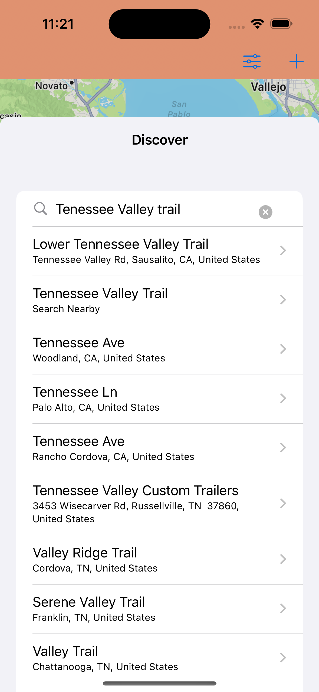

#  All Those Places We Visit

This app lets the user build a collection of places. While planning your trip you can create icons for each different activity. These places can be marked as visited or be added to your favorite locations. You can customize your added place by adding a picture. Additional functionalities to build could be adding links to websites or text. 

All these functionalities will make it easier to keep track of places that you want to visit or have visited without all the extra clicking to remember what type of activity that place is.

The app can be downloaded upon request through TestFlight.

The below figures show a preview of the app.

<!--Splash View |  Content View              | Detail View | Add Place        -->
<!--:-------------------------:|:-------------------------:|:--------------------->
    
 
  
